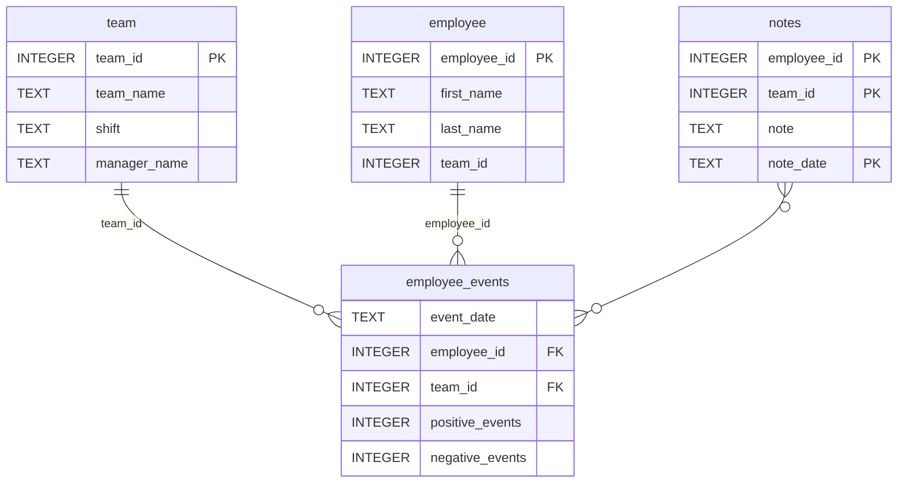

# Employee Retention Dashboard

## Overview
This project is a dashboard for visualizing employee and team events. It includes features like:
- Filtering by employee or team.
- Visualizing event trends.
- Predicting recruitment risk.

## Table of Contents
1. [Installation](#installation)
2. [Repository Structure](#repository-structure)
3. [Database Schema](#database-schema)
4. [Project Motivation](#motivation)
5. [File Descriptions](#files)
6. [Results](#results)
7. [Licensing, Authors, and Acknowledgements](#licensing)

---

## Installation Guide <a name="installation"></a>

1. Clone the repository:
   ```bash
   git clone https://github.com/fraser-code/dsnd-dashboard-project.git
   ```
2. Install the dependencies:
   ```bash
   pip install -r python_package/requirements.txt
   ```
3. Run the dashboard:
   ```bash
   python python_package/report/dashboard.py
   ```

## Repository Structure <a name="repository-structure"></a>
```
├── README.md
├── assets
│   ├── model.pkl
│   └── report.css
├── env
├── python-package
│   ├── employee_events
│   │   ├── __init__.py
│   │   ├── employee.py
│   │   ├── employee_events.db
│   │   ├── query_base.py
│   │   ├── sql_execution.py
│   │   └── team.py
│   ├── requirements.txt
│   ├── setup.py
├── report
│   ├── base_components
│   │   ├── __init__.py
│   │   ├── base_component.py
│   │   ├── data_table.py
│   │   ├── dropdown.py
│   │   ├── matplotlib_viz.py
│   │   └── radio.py
│   ├── combined_components
│   │   ├── __init__.py
│   │   ├── combined_component.py
│   │   └── form_group.py
│   ├── dashboard.py
│   └── utils.py
├── requirements.txt
├── start
├── tests
│   └── test_employee_events.py
```

## Database Schema <a name="database-schema"></a>


## Project Motivation <a name="motivation"></a>

### Business Scenario
As a data scientist in my company, I am working on addressing a key concern 
from upper management: the risk of losing top employees to competitors. To 
tackle this issue, our data team has:

- Deployed a data entry form that allows managers to record employee 
  performance events, both positive and negative.
- Created a database (`employee_events`) to store and manage these inputs.
- Developed a machine learning model to predict the likelihood of an employee 
  being recruited by another company.

### Technical Scenario
My role in this project involves:

- **Building a dashboard** that enables managers to:
  - Monitor employee and team productivity in real-time.
  - View predictions on the risk of employees or teams being recruited.
- **Publishing a Python API** for the `employee_events` database to ensure 
  seamless access to data across different teams.

### Project Goals

- **Dashboard**: Visualize employee/team performance and recruitment risk.
- **Python API**: Provide SQL query-based datasets for business-critical insights.
- **Code Reusability**: Extend and customize pre-built Python classes using Object-Oriented Programming (OOP).

## File Descriptions <a name="files"></a>

The repository contains the following key files and directories:

### Python Package (`python_package/`)

#### `employee_events/`:
- `employee.py`: Python API for querying employee data.
- `team.py`: Python API for querying team data.
- `query_base.py`: Base class for SQL queries.
- `sql_execution.py`: Utility for executing SQL queries.
- `employee_events.db`: SQLite database storing performance events.

#### `assets/`:
- `model.pkl`: Machine learning model for recruitment risk prediction.
- `report.css`: CSS file for styling the dashboard.

#### `report/`:
- `dashboard.py`: Main dashboard application.
- `base_components/`: Reusable UI components (e.g., dropdowns, charts).
- `combined_components/`: Composite UI components (e.g., form groups).
- `utils.py`: Utility functions (e.g., loading the model, connecting to the database).

- `setup.py`: Script for packaging the Python API.

### Tests (`tests/`)
- `test_employee_events.py`: Unit tests for the Python API.

### Other Files
- `README.md`: Project documentation.
- `.gitignore`: Specifies files to ignore in version control.
- `requirements.txt`: Lists project dependencies.

## Results <a name="results"></a>

The Employee Retention Dashboard provides the following key features:

### Employee/Team Productivity:
- Visualize cumulative trends of positive and negative performance events over time.

### Recruitment Risk Prediction:
- Display the likelihood of an employee or team being recruited by competitors.

### Interactive Filters:
- Allow managers to switch between employee and team views.
- Dynamically update visualizations based on selected filters.

## Licensing, Authors, and Acknowledgements <a name="licensing"></a>

### Licensing
This project is released under an open-source license. See the LICENSE file for details.

### Authors
**Fraser Fernandes**: Data Scientist and Developer of the Employee Retention Dashboard.

### Acknowledgements
- **FastAPI**: For the dashboard framework used in this project.
- **Stack Overflow**: For inspiration on project structure and documentation.
