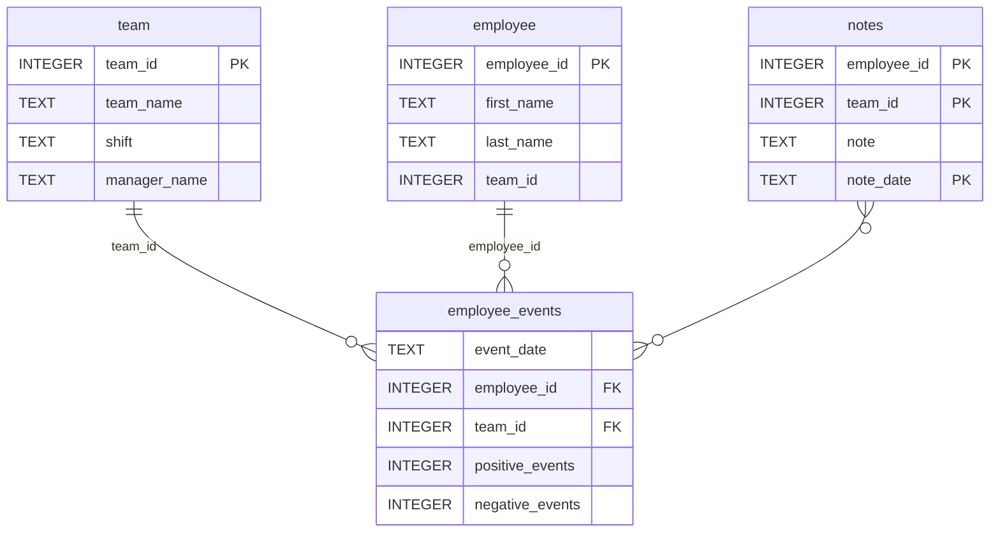

# Employee Events Package

This package provides a Python API for interacting with the `employee_events` database. It includes modules for querying employee and team data, executing SQL queries, and managing database connections.

---

## Files

### **1. `employee.py`**
- **Purpose**: Provides functionality to query and manage employee-related data.
- **Key Features**:
  - Fetch employee names and IDs.
  - Retrieve employee-specific performance data.
  - Predict recruitment risk for individual employees.

### **2. `team.py`**
- **Purpose**: Provides functionality to query and manage team-related data.
- **Key Features**:
  - Fetch team names and IDs.
  - Retrieve team-specific performance data.
  - Predict recruitment risk for teams.

### **3. `sql_execution.py`**
- **Purpose**: Handles database connections and SQL query execution.
- **Key Features**:
  - Establishes a connection to the SQLite database (`employee_events.db`).
  - Executes SQL queries and returns results as pandas DataFrames or raw data.

### **4. `query_base.py`**
- **Purpose**: Serves as a base class for common SQL queries.
- **Key Features**:
  - Provides reusable methods for querying event counts, notes, and other critical datasets.
  - Inherited by `employee.py` and `team.py` for specific query implementations.

---

## Usage

To use this package, import the necessary modules and initialize the classes:

```python
from employee_events.employee import Employee
from employee_events.team import Team

# Example: Fetch employee data
employee = Employee()
employee_data = employee.names()

# Example: Fetch team data
team = Team()
team_data = team.names()
